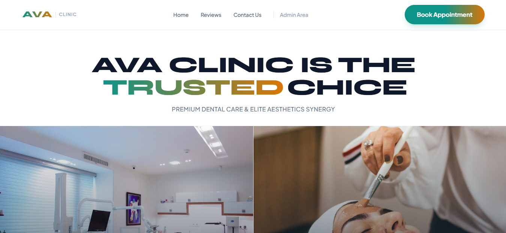

# 🏥 AVA Clinic - Premium Dental & Aesthetics Platform

[](https://nextjs.org/)
[](https://tailwindcss.com/)
[](https://github.com/framer/motion)

An ultra-luxury, high-performance, full-stack web application custom-built for **AVA Clinic**, specializing in premium dental care and elite aesthetic services. This platform delivers a VIP, high-conversion patient experience integrated with a dynamic backend booking infrastructure.

<p align="center">
  
</p>

---

## ✨ Key Features & Business Logic

- **👑 Dual-Core VIP Homepage:** A luxury split-screen ecosystem tailored for two distinct patient demographics (Dental Surgery vs. Advanced Aesthetics).
- **📅 Smart Booking Engine:** Seamless, real-time appointment scheduling flows with robust validation and slot locking capabilities.
- **🔐 Secure Admin CRM Dashboard:** Exclusive administrative portal protected by secure authentication (`admin123` access controller) featuring high-level calendar operations and appointment status toggling.
- **🧬 Immersive UX Architecture:** Smooth scrolling animations, micro-interactions, and premium dynamic typography leveraging `Framer Motion` and asynchronous `ScrollReveal` layers.
- **⚡ Server-Side Optimization:** Fully leveraging Next.js 14 App Router for rapid page compilation, absolute SEO readiness, and optimized custom Google Font injections.

---

## 📂 Project Directory Structure & Architecture

```text
ava-clinic/
├── public/                      # Static assets, branding vectors, and media
│   └── images/
│       ├── dental-hero.jpg      # High-end photography for Dental core
│       └── beauty-hero.jpg      # High-end photography for Aesthetic core
├── src/
│   ├── app/                     # Next.js 14 App Router (Core Application Layers)
│   │   ├── layout.js            # Global layout wrapper (Premium Shared Shell)
│   │   ├── page.js              # Dual-core Homepage entry point
│   │   ├── globals.css          # Tailwinds baseline & critical layout animations
│   │   ├── booking/             # Dynamic Appointment Booking Portal
│   │   │   └── page.js
│   │   ├── reviews/             # Interactive Customer Experience & Reviews
│   │   │   └── page.js
│   │   ├── contact/             # High-conversion Lead Contact Module
│   │   │   └── page.js
│   │   ├── login/               # Protected Admin Portal Gateway
│   │   │   └── page.js
│   │   ├── admin-panel/         # Interactive Admin CRM Calendar Panel
│   │   │   └── page.js
│   │   └── api/                 # Monolithic Backend Architecture (API Routes)
│   │       ├── bookings/        # Serverless controller for DB read/writes
│   │       │   └── route.js
│   │       └── admin/           # Auth and scheduling operations controller
│   │           └── route.js
│   ├── components/              # Modular, Reusable UI/UX Elements
│   │   ├── Header.js            # Sticky responsive Navigation with Dynamic CTAs
│   │   ├── Footer.js            # Shared brand-compliance structure
│   │   ├── AnimatedText.js      # Dynamic typography and word morphing utilities
│   │   └── ScrollReveal.js      # Asynchronous scroll-driven viewport wrapper
│   └── lib/                     # Database utilities & Core Integrations
│       └── db.js                # Database connection handler (SQLite/Cloud)
├── tailwind.config.js           # Customized brand tokens (Color palette & Display fonts)
├── postcss.config.js            # PostCSS processing compiler directives
├── package.json                 # Production and Development Node dependencies

```
---

## 🛠️ Production Tech Stack

- **Frontend Core:** React 18, Next.js 14.2.3 (App Router ecosystem)
- **Styling & UI:** Tailwind CSS, PostCSS, Autoprefixer (Brand Colors: Slate, Teal, Amber)
- **Fluid Mechanics:** Framer Motion (Hardware-accelerated web animations)
- **Iconography:** Lucide React (Vector-perfect interface graphics)

---

## 🚀 Installation & Local Deployment

Follow these quick steps to get a local instance of AVA Clinic up and running on your machine:

1. **Clone the Repository:**
   ```bash
   git clone [https://github.com/parsaBABALOO/AVA-Clinic-Website.git](https://github.com/parsaBABALOO/AVA-Clinic-Website.git)
   cd AVA-Clinic-Website
   ```
2. **Install Engine Dependencies:**
   ```bash
   npm install
   ```
3. **Initialize the Local Server:**
   ```bash
   npm run dev
   ```
4. **Access the Application:**
Open http://localhost:3000 inside your browser.

---

## 📈 Scalability & Future Roadmap
[ ] Implementation of secure multi-factor authentication (JWT / NextAuth).

[ ] Integration of live SMS and Email automation gateways for instant patient slot confirmation.

[ ] Automated online payment gateways (Stripe / Local Portals) for deposit security.

[ ] Multi-lingual support (International Localization Framework).

---

## 📬 Contact

Developer: PARSA BABALOO
Email: parsababalo1403@gmail.com

Note: Any other contact information (including Telegram channels or usernames) associated with this project is not official and should be considered invalid or unrelated to the developer.

---

**⭐ If this project helped you, please give it a star! ⭐**
